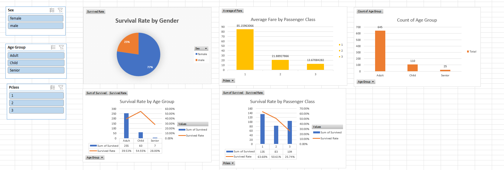

# Titanic Survival Analysis Dashboard (Excel)

## Project Overview

This project analyzes the Titanic passenger dataset using Microsoft Excel to identify factors that influenced passenger survival. The analysis includes data cleaning, KPI calculation using Excel formulas, Pivot Table analysis, data visualization through Pivot Charts, and insight generation through an interactive dashboard.

## Objective

The objective of this project is to explore passenger demographics and travel information, identify survival patterns, and present key findings through data-driven analysis and visualization.

## Dataset

The dataset contains information about Titanic passengers, including:

- Passenger Class (Pclass)
- Gender (Sex)
- Age
- Fare
- Embarkation Port
- Survival Status

## Tools & Techniques Used

- Microsoft Excel
- Data Cleaning
- Excel Formulas
- KPI Calculation
- Pivot Tables
- Pivot Charts
- Dashboard Design
- Data Visualization
- Insight Generation

## Project Structure

### Sheet 1: Original Data
Contains the raw Titanic passenger dataset before preprocessing.

### Sheet 2: Cleaned Data
Contains the cleaned dataset after handling missing values and preparing the data for analysis.

### Sheet 3: KPIs & Pivot Tables
Contains KPI calculations created using Excel formulas and Pivot Tables used for analytical exploration.

**KPIs Calculated:**
- Total Passengers
- Total Survivors
- Overall Survival Rate (%)
- Average Age
- Average Fare

### Sheet 4: Charts & Dashboard
Contains Pivot Charts and dashboard visualizations used to analyze:

- Survival Rate by Gender
- Survival Rate by Passenger Class
- Survival Rate by Age Group
- Passenger Count by Age Group
- Average Fare by Passenger Class

Interactive slicers were added to enable dynamic filtering across dashboard visualizations.

### Sheet 5: Insights
Contains key findings and conclusions derived from KPI calculations, Pivot Tables, and dashboard analysis.

## Key Findings

- Out of 780 passengers, 322 survived, resulting in an overall survival rate of 41.28%.
- Female passengers had a survival rate of 73.97%, significantly higher than the male survival rate of 21.72%.
- First-class passengers recorded the highest survival rate (63.68%), while third-class passengers had the lowest (25.74%).
- Children had the highest survival rate (54.55%), followed by adults (39.53%) and seniors (28.00%).
- Average fares were highest for First Class passengers (85.16) and lowest for Third Class passengers (13.67).
- Gender, passenger class, and age were key factors influencing survival outcomes.

## Skills Demonstrated

- Data Cleaning and Preparation
- Excel Formula Implementation
- KPI Development
- Pivot Table Analysis
- Data Visualization
- Dashboard Creation
- Business Insight Generation
- Reporting and Presentation

## Repository Contents

- 'Titanic.xlsx' - Complete Excel project workbook
- 'Dashboard_Screenshot.png' - Dashboard preview
- 'README.md' - Project documentation

## Dashboard Preview

Add a screenshot of the dashboard below.

## Conclusion

This project demonstrates the use of Microsoft Excel for end-to-end data analysis, from data cleaning and KPI creation to visualization and insight generation. The analysis highlights how demographic and socioeconomic factors influenced passenger survival during the Titanic disaster.

## Author

**Shital Patil**
